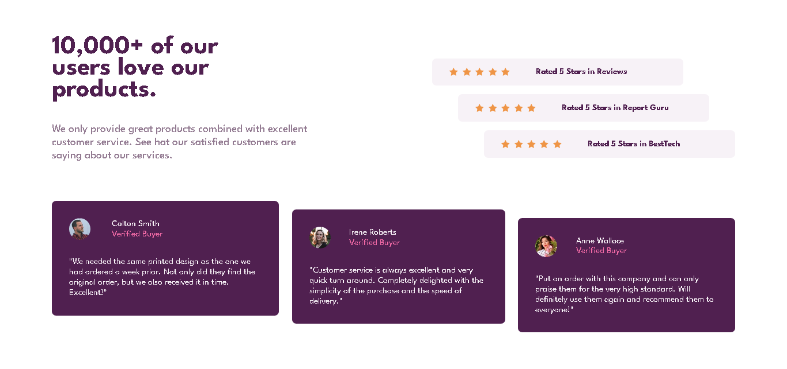

# social-proof-section
Solution for the social proof section challenge of Frontend Mentor. Coded by Stiven Ojeda.
This is a solution to the [Social proof section challenge on Frontend Mentor](https://www.frontendmentor.io/challenges/social-proof-section-6e0qTv_bA).

## Table of contents
- [Overview](#overview)
  - [The challenge](#the-challenge)
  - [Screenshot](#screenshot)
  - [Links](#links)
- [My process](#my-process)
  - [Built with](#built-with)
  - [What I learned](#what-i-learned)
  - [Useful resources](#useful-resources)
- [About me](#about-me)

## Overview

### The challenge
Users should be able to:
- View the optimal layout for the section depending on their device's screen size

### Screenshot

### Links
- [Challenge's website](https://www.frontendmentor.io/challenges/social-proof-section-6e0qTv_bA)
- [Live solution page](https://stibojeda.github.io/social-proof-section/)
- [Code repository](https://github.com/stibojeda/social-proof-section)

## My process

### Built with
- Semantic HTML5 markup
- CSS custom properties
- Flexbox
- CSS grid
- Mobile first method

### What I learned
I practiced mi knowledges of CSS and structuring with grid.

### Useful resources
- [MDN documentation](https://developer.mozilla.org/en-US/docs/Web/CSS)
- [Free Code Camp](https://www.youtube.com/watch?v=XqFR2lqBYPs)
- [CURSO CSS desde Cero - CSS BÁSICO Para PRINCIPIANTES](https://www.youtube.com/watch?v=N8V5JhasaSE)

## About me
- Portfolio: [Stiven Ojeda](https://stibojeda.github.io)
- Linkedin: [Stiven Ojeda](https://www.linkedin.com/in/stiven-ojeda-090a3924a)
- GitHub: [Stiven Ojeda](https://github.com/stibojeda)
